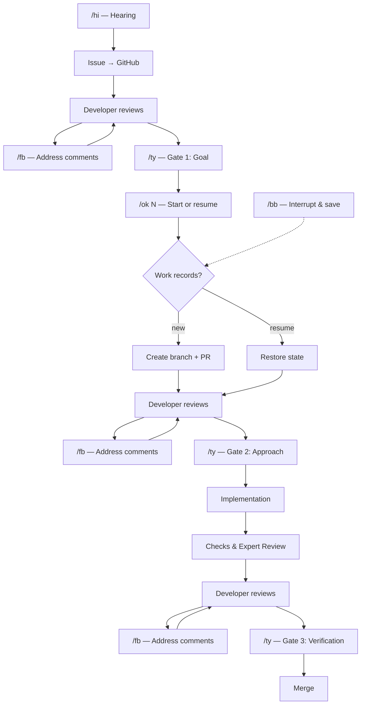

# aiya-dev

Agents in your area — multiple agent instances, right in your dev environment.

- **No babysitting** — Three gates (Goal → Approach → Verification) guard quality so you don't have to watch over every step
- **Scale as one** — Async checkpoints let you run multiple instances in parallel and multiply your throughput
- **Walk away anytime** — Save and restore work state on demand. Step away, come back, pick up where you left off

## Quick Start

**Prerequisites:** WSL2 (Ubuntu) on Windows, Bash, and a GitHub token.

```bash
curl -fsSL https://raw.githubusercontent.com/lovaizu/aiya-dev/main/setup/wc.sh | bash

cd aiya-dev
vi .env    # Set GH_TOKEN and other tokens

./up.sh 4  # Opens 5 panes (4 workers + 1 additional)
```

## How It Works



## Usage (Shell commands)

```bash
./up.sh 4              # Start 4 parallel workers
./up.sh                # Resume previous session
./dn.sh                # Stop the tmux session
```

## Commands

| Command | Full Name | What it does |
|---------|-----------|-------------|
| `wc.sh` | Welcome | First-time setup: clone, install tools, create worktrees |
| `up.sh` | Up | Start or resume a tmux session with parallel workers |
| `dn.sh` | Down | Stop the tmux session started by up.sh |
| `/hi` | Hi | Start hearing → create issue |
| `/ok <number>` | OK | Start or resume work on an issue |
| `/bb` | Bye-bye | Interrupt work, save state for resumption |
| `/fb` | Feedback | Address feedback comments on Issues or PRs |
| `/ty` | Thank you | Approve the current gate |

## Directory Structure

```
aiya-dev/
├── .bare/              Bare clone
├── .env                Environment variables (AIYA_* prefix)
├── up.sh               Symlink → main/setup/up.sh
├── dn.sh               Symlink → main/setup/dn.sh
├── main/               Worktree (default)
│   ├── setup/          wc.sh, up.sh, dn.sh
│   ├── .aiya/
│   │   └── issues/     Work records per issue
│   ├── .claude/        Commands, rules, hooks
│   └── ...
├── work-1/             Worktree
├── work-2/
├── work-3/
└── work-4/
```

## Skills

| Skill | Description |
|-------|-------------|
| skill-smith | Create, improve, and evaluate Claude skills. Includes validation with PASS/FAIL/WARN grading. |

## Learn More

- [Methodology](docs/methodology.md) — Traceability Chain, Phases and Gates
