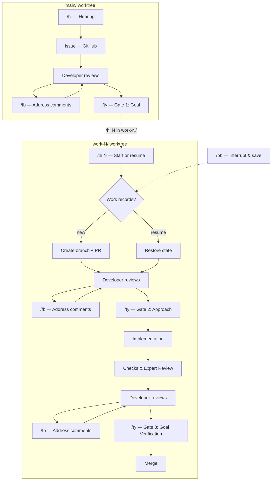

# ciya-dev

Claude Code in your area — multiple Claude Code instances, right in your dev environment.

- **No babysitting** — Three gates (Goal → Approach → Verification) guard quality so you don't have to watch over every step
- **Scale as one** — Async checkpoints let you run multiple instances in parallel and multiply your throughput
- **Walk away anytime** — Save and restore work state on demand. Step away, come back, pick up where you left off

## Workflow



**How it works:**
- You create issues in `main/` and assign them to `work-N/` panes — the agent handles the rest autonomously
- Your only job is to review at three gates: approve the goal, the approach, and the final result
- You interact through four commands (`/hi`, `/ty`, `/fb`, `/bb`) and review comments on GitHub — nothing else
- At any point, `/bb` saves progress for later resumption

## Usage

### First-time setup

```bash
curl -fsSL https://raw.githubusercontent.com/lovaizu/ciya-dev/main/scripts/wc.sh | bash

cd ciya-dev
vi .env    # Set GH_TOKEN and other tokens
```

### Starting sessions

```bash
./up.sh 4
# Opens 4 parallel workers (plus 1 for issue management)
# Launches tmux session "ciya" with 5 panes
# Each pane runs Claude Code automatically
```

### Resuming a previous session

```bash
./up.sh
# No arguments → reads saved config (or CIYA_WORK_COUNT from .env)
```

### Scaling up and down

```bash
./up.sh 6    # Scale up to 6 parallel workers
./up.sh 4    # Scale back to 4 (removes idle workers)
```

### Working on issues

In the **main/** pane:
```
/hi                    # Start hearing → brainstorm → create issue on GitHub
/fb                    # Address any issue comments
/ty                    # Gate 1: Approve the goal
```

In a **work-N/** pane:
```
/hi 42                 # Start working on issue #42
/fb                    # Address any PR comments
/ty                    # Gate 2: Approve the approach → implementation begins
                       # ... CC implements, pushes commits ...
/fb                    # Address any review comments
/ty                    # Gate 3: Verify goal achieved → squash merge
```

### Interrupting and resuming work

```
/bb                    # Saves state to .ciya/issues/nnnnn/resume.md
/hi 42                 # Later, in any work-N/: resumes where you left off
```

## Commands

| Command | Where | What it does |
|---------|-------|-------------|
| `/hi` | main/ | Start hearing → create issue |
| `/hi <issue#>` | work-N/ | Start or resume work on an issue |
| `/bb` | work-N/ | Interrupt work, save state for resumption |
| `/fb` | any | Address feedback comments on Issues or PRs |
| `/ty` | any | Approve the current gate |

## Three Gates

| Gate | Question | Where |
|------|----------|-------|
| Goal | Is the issue capturing the right problem and goal? | GitHub Issue page |
| Approach | Can the PR's approach achieve the goal? | GitHub PR page |
| Goal Verification | Has the goal been achieved? | GitHub PR page |

At each gate: review on GitHub, leave comments if needed (`/fb` to address them), then `/ty` to approve.

## Directory Structure

```
ciya-dev/
├── .bare/              Bare clone
├── .env                Environment variables (CIYA_* prefix)
├── up.sh               Symlink → main/scripts/up.sh
├── main/               Issue management worktree
│   ├── scripts/        wc.sh, up.sh
│   ├── .ciya/
│   │   └── issues/     Work records per issue
│   ├── .claude/        Commands, rules, hooks
│   └── ...
├── work-1/             Implementation worktree
├── work-2/
├── work-3/
└── work-4/
```

## Skills

| Skill | Description |
|-------|-------------|
| skill-smith | Create, improve, and evaluate Claude skills following Anthropic's Guide. Includes structural validation with PASS/FAIL/WARN grading. |
