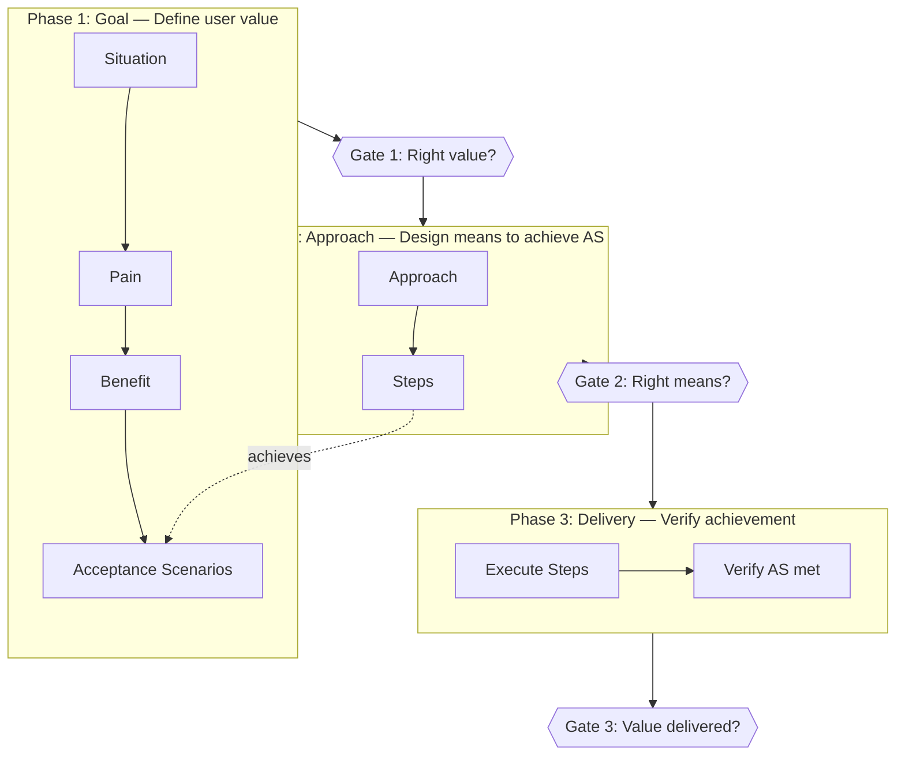
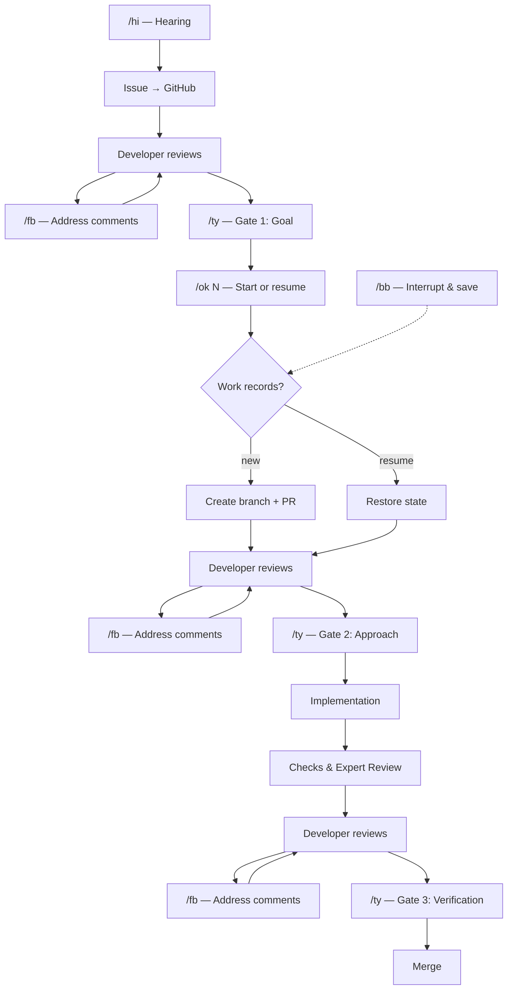

[← Back to README](../README.md)

# Methodology

## Traceability Chain

Every element in the workflow traces back to user value. If a link is missing, the process breaks.

**Issue (what):**
- **Situation** — Observable facts and circumstances
- **Pain** — Who suffers and how (the problem to solve)
- **Benefit** — Who gains what, once resolved (the value to deliver)
- **Acceptance Scenarios** — Given-When-Then scenarios that verify Benefit is achieved, grouped by target user

**PR (how):**
- **Approach** — AS-to-means mapping table: what means will achieve each AS
- **Steps** — Concrete work steps to implement each Approach, grouped by Approach

Issue-side rules:
- Every Pain must arise from the Situation. A Pain with no Situation basis is an ungrounded assumption.
- Every Benefit must trace from a Pain. A Benefit with no Pain link is solving a problem that doesn't exist.
- Every AS must connect to a Benefit. An AS with no Benefit link is measuring the wrong thing.

PR-side rules:
- Every AS must appear in the Approach table. An uncovered AS will not be achieved.
- Every Step must be grouped under its Approach. A Step unrelated to any Approach indicates a misalignment.
- Steps must fully implement the Approach they belong to.

## Phases and Gates

The workflow has three phases. Each phase has a clear purpose, and a gate where the developer reviews whether that purpose is met.

| Phase | Purpose | Gate | The developer asks |
|-------|---------|------|--------------------|
| **Goal** | Define user value | Gate 1: Goal | Do Benefit and Acceptance Scenarios capture the right user value? |
| **Approach** | Design means to achieve AS | Gate 2: Approach | Can Approach and Steps achieve all AS? |
| **Delivery** | Verify achievement | Gate 3: Verification | Are AS met and Benefits realized? |

### Goal Phase

**Purpose:** Define what user value we want to deliver.

The developer and agent identify Pain, articulate the desired Benefit, and define Acceptance Scenarios that verify the Benefit is achieved.

**Gate 1 — Goal:**
- **Relevant:** Situation, Pain, Benefit, AS — are the facts accurate, the problem real, and the measure of success right?
- **Irrelevant:** Implementation details, current architecture, technical feasibility

### Approach Phase

**Purpose:** Design the means to achieve the Acceptance Scenarios.

The agent drafts an Approach table mapping each AS to its means, then defines Steps grouped by Approach.

**Gate 2 — Approach:**
- **Relevant:** Does Approach cover all AS? Do Steps implement the Approach? Is this the optimal strategy?
- **Irrelevant:** Whether the goal itself is right (already approved at Gate 1)

### Delivery Phase

**Purpose:** Implement and verify that the goal is achieved.

The agent implements Steps, verifies AS are met, and confirms Benefits are realized.

**Gate 3 — Verification:**
- **Relevant:** Are AS met? Are Benefits realized? Does the implementation match the approved Approach?
- **Irrelevant:** Whether the approach was optimal (already approved at Gate 2)

At each gate: review on GitHub, leave comments if needed (`/fb` to address them), then `/ty` to approve.

## Workflow

**How it works:**
- `/hi` creates issues, `/ok` starts implementation — use either command in any pane
- Your only job is to review at three gates: approve the goal, the approach, and the final result
- You interact through five commands (`/hi`, `/ok`, `/ty`, `/fb`, `/bb`) and review comments on GitHub — nothing else
- At any point, `/bb` saves progress for later resumption
